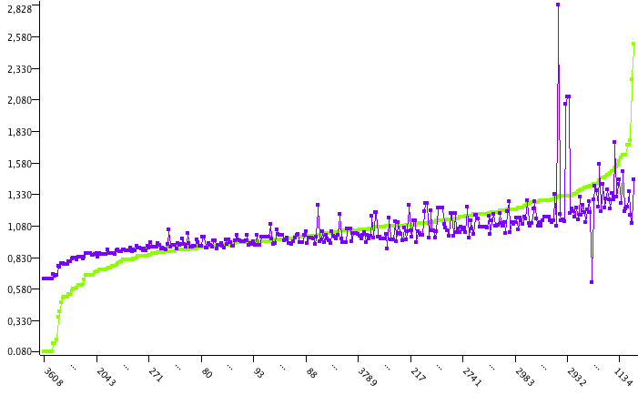

# Regression analysis of exoplanets masses

## Objectives

* Deal with a realistic Machine Learning application 

* Extract and preprocess a real dataset

* Perform a realistic exploratory analysis

* Implement a realistic Machine Learning workflow

This assignment assumes a basic knowledge of descriptive Statistics.

## Preliminary steps

First, it is advisable to get a basic knowledge about exoplanets detection methods and orbital elements. The following two readings are a good introduction to some concepts that we will be handling in this assignment.

* [Five Ways to Find a Planet](https://exoplanets.nasa.gov/5-ways-to-find-a-planet/)

* [Orbital elements](https://en.wikipedia.org/wiki/Orbital_elements)

It is usefull to remember the basic ML steps:

1. Adquire data.
2. Select data.
3. Exploratory analysis of data.
4. Train the model
5. Evaluate the model.
6. Go to 2 until a good enough model is found.

You will need a data analytics tools, for instance, [KNIME Analytics Platform](https://www.knime.com/knime-software/knime-analytics-platform), which is free in its basic version and pretty easy to use. 

## Assignment goal

The goal of this assignment is to train a regression model of exoplanets mass. To achieve this goal it is required first to perform a basic descriptive analysis of the dataset complemented with the development of the regression models.

## Data adquisition and selection

Download the exoplanet dataset from the [NASA Exploplanet Archive](https://exoplanetarchive.ipac.caltech.edu/cgi-bin/TblView/nph-tblView?app=ExoTbls&config=PS). This dataset contains a collection of confirmed exoplanets along with several attributes about them. Download the dataset in *CSV format* and **values-only**; please select the column "Planet Density" which is not selected by default. You may need to configure your browser to allow the website to open pop-ups.

Once the dataset was downloaded (consider only the default attributes), visualize its header using any tool of your choice (Linux command, text editor, etc) to get an insight about the attributes codification. If you are interested in getting a complete description, [read this link](https://exoplanetarchive.ipac.caltech.edu/docs/API_PS_columns.html).

The first step in any ML project is to get a basic understanding of the data at hand. To this end, apply any technique at your disposal (Statistics, histograms, etc) to answer the following questions:

1. How many instances and attributes does the dataset contain? <!--(Hint: Use the Statistics node)-->

2. How many exoplanets were discovered? How many exoplanets were discovered with each detection method? Which detection methods does the dataset contain? <!-- (Hint: The groupBy node is handy in to answer that kind of questions)-->

3. Does the dataset contain missing values?

## Univariable exploratory analysis

This assignment is interested in forecasting the exoplanet mass, so many of the information contained in the dataset is irrelevant. However, distinguishing between relevant and irrelevant features is, itself, a challenging task most of the times.

In a first attempt to better understand our data, we will consider only those attributes which are directly associated with mass. Insert a KNIME node to drop all the attributes, with the exception of the following ones:

* pl_dens
* pl_mass
* pl_radj

Perform a exploratory univariable analysis of those attributes, and in particular identify maximum and minimum values, average value and median value. Identify missing values and outliers. If any, remove missing values and outliers.

Analyze the results.

## Bivariable exploratory analysis

Compute the correlation matrix and visualize a scatterplot matrix to identify correlations among the variables. 

Analyze the results.

## Regression analysis

The final goal of this assignment is to predict the exoplanet mass, which in ML terminology means training a regression model.

Implement a linear regression with *pl_mass* as target attribute. Train the model with the 70% of the data, and validate it with the remaining 30% of the data. Compute, on the validation set, the [R2](https://en.wikipedia.org/wiki/Coefficient_of_determination) using a [Numeric Scorer](https://nodepit.com/node/org.knime.base.node.mine.scorer.numeric.NumericScorerNodeFactory) node. A complementary tool to assess the model fit is a plot comparing the predicted mass to the actual mass, as the following figure shows. A proper interpretation of the plot should suggest how to improve the regression model.

The objective of model evaluation is to determine whether the model fits well the data. For the purpose of this assignment, we will consider a satisfactory model that one with R2>0.65.

Introduce any change to the model to increase the model fit. You can change the regression model, add or remove attributes (perhaps orbital measures?), or build new attributes. Take into account that the model interpretation could provide you valuable information, for instance, the p-values or coefficients values.

Analyze the results.

The output of this assignment is a figure of the forecasted and observed values along with an estimation of R2.

## (Optional) Classification analysis

In this part of the assignment we will try to determine the detection method. 

1. Clean the dataset.
   * Drop irrelevant attributes (for instance, planet name). Take into account that you could find interesting previously unknown relationships ... for instance, published confirmed planets (solution type) might be biased.
   * Remove attributes that contain duplicate information (for instance, planet mass expressed in different units).
   * Count the number of planets discovered by each method. Is the dataset balanced? In general, you should use Cohen's kappa to compare classifiers with unbalanced data. 
   * Drop all instances whose detection method is different than "Transit" or "Radial Velocity". (Hint: use the node "Value Filter").
2. Classify the discovery method using a tree classifier.
   * Which variable does the classifier identify as most relevant? You may want to use the "Decision Tree View" node to ease the inspection of the classifier. 
   * Remove that attribute, retrain the classifier and assess its kappa. Repeat it several times, what does happen to the classifier performance?
3. Experiment with different classifiers and try to improve the performance.
4. Consider only pl_dens, pl_mass and pl_radj as in the previous exercise, and retrain the classifier. What happens?
