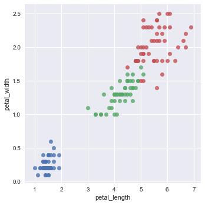
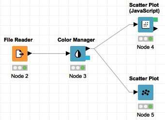
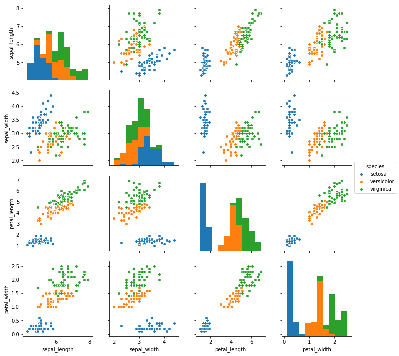

# Introduction to KNIME Analytics Platform

## Objectives

* Install KNIME

* First steps with KNIME

* Implement basic Machine Learning workflows with KNIME

* Data exploration with KNIME

## KNIME first contact

The KNIME installation instructions along with relevant information for a first contact can be found in this [link](https://www.knime.com/installation). Please, carefully read that document and watch the video contained in it. After that, read the [KNIME Getting Started Guide](https://www.knime.com/getting-started-guide) and the [KNIME Workbench Guide](https://docs.knime.com/latest/analytics_platform_workbench_guide/index.html). You may want to watch this [video tutorial](https://www.youtube.com/watch?v=A32NoHC4Uf8).

<!--

After that, watch the following videos:

1. [What is a Node, What is a Workflow](https://www.knime.com/knime-introductory-course/chapter1/section2/what-is-a-node-what-is-a-workflow)

2. [Node Repository](https://www.knime.com/knime-introductory-course/chapter1/section2/node-repository)

3. [Workflows and Workflow Groups](https://www.knime.com/knime-introductory-course/chapter1/section3/workflows-and-workflow-groups)

4. [Node Status and Operations](https://www.knime.com/knime-introductory-course/chapter1/section3/node-status-and-operations)

5. [Data Table Structure](https://www.knime.com/knime-introductory-course/chapter1/section3/data-table-structure)

6. [Document your workflow: Annotations & Comments](https://www.knime.com/knime-introductory-course/chapter1/section3/document-your-workflow-annotations-and-comments)
-->

KNIME comes with an excellent collection of examples covering both basic and advanced Machine Learning workflows. Browing those examples is good way to getting down with KNIME and Machine Learning. KNIME provides a set of local examples, it also has access to an examples server, which reads and downloads examples on-demand. 

Go through the following examples trying to understand what is going on. You may want to inspect a node output by right-clicking the node and selecting the data table.

1. *LOCAL/Basic Examples/Building a Simple Classifier*

2. *LOCAL/Basic Examples/Data Blending*

3. *SERVER/04_Analytics/02_Statistics/01_Simple_Example_with_Statistics*

4. *SERVER/04_Analytics/03_Clustering/01_Performing_a_k-Means_Clustering*

5. *SERVER/04_Analytics/04_Classification_and_Predictive_Models/07_Decision_Tree*

6. *SERVER/04_Analytics/05_Regressions/01_Learning_a_Simple_Regression_Tree*

## Dataset preliminary steps

Perhaps the most famous dataset in Machine Learning is one introduced by Fisher in 1936. The dataset contains measures of three different species of a flower named Iris (petal width, petal height, sepal width and sepal height), along with the species name (Iris setosa, Iris versicolor, Iris virginica). In order to better understand what petal and sepal stands for, please, observe the figure below. 

The iris dataset is widely used in Machine Learning literature as an example. To follow up this tradition, we will use that dataset in this introductory assignment.

(Image taken from [here](http://blog.kaggle.com/2015/04/22/scikit-learn-video-3-machine-learning-first-steps-with-the-iris-dataset/).)

Download the famous [iris dataset](iris.csv) and store it in an accesible location. Please observe that the file has CSV format, which is a widely used format in Machine Learning because of its simplicity; read [this](https://en.wikipedia.org/wiki/Comma-separated_values#Example) in case you need additional information about CSV.

Open the CSV file with a text editor of your choice to have a look. Count the number of attributes and instances in the dataset and observe the attributes data types.

## Exercises

Create a new workflow group named "exercises" to store the exercises, create a new workflow for each one of the following exercises.

1. Load the Iris dataset with a "File Reader" node and compute its main statistics (such as mean, median, standard deviation, etc) with the "Statistics" node.

2. Compute the average value of the four numerical attributes for each Iris species. (Hint: Watch this [video](https://www.youtube.com/watch?v=JQ-OWMt48ew)).

3. Scatterplot are a great tool to visualize the relationship between two variables. Reproduce the scatterplot in the image using the given workflow in KNIME. (Hint: Inspect the output of the "Color Manager" node to better understand what is going on).

4. A natural extension of scatterplots to visualize relationships among several attributes is the scatterplot matrix. Implement a KNIME workflow to reproduce the scatterplot matrix given in the figure.

5. Train a decision tree classifier to predict the iris species given the measures of a petal and a sepal. (Hint: Open the example *04_Analytics/04_Classification_and__Predictive_Learning/01_Example_for_Learning_a_Decision_Tree*)

6. Train a neural network to predict the iris species given the measures of a petal and a sepal. You should notice that a Neural Network should take a normalized input (Hint: Open the example *04_Analytics/04_Classification_and__Predictive_Learning/02_Example_for_Learning_a_Neural_Network*, use one hidden layer with five neurons)

7. Open the example *04_Analytics/03_Clustering/01_Performing_a_k-Means_Clustering* and try to understand the workflow*.

8. Browse the examples folder *50_Applications*. This folder contains lots of interesting application examples of KNIME, including some pretty advanced ones. Open any application you find interesting and try to understand the workflow.
