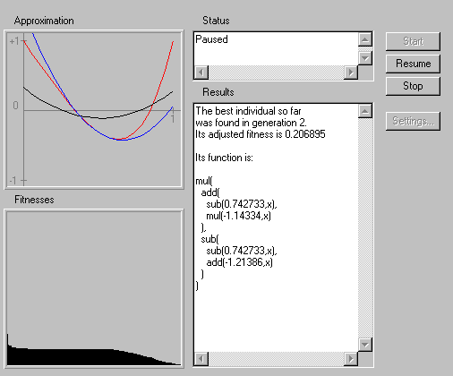

# Symbolic regression with Genetic Programming (non-inspyred exercise)

## Objectives

* First contact with Genetic Programming

* Introduce the symbolic regression problem

## One-max problem with Inspyred

Regression is a classical problem in Machine Learning. If you understand the classical lineal regression, you already know what the regression problem is. Given a set of samples drawn from a function, the problem is to find the symbolic representation of that function. The range of applications is huge, financial modelling or whaether forecasting, may serve as examples. A function has a non-linear nature, and is well represented by trees, so, not surprisingly GP is widely use to tackle this kind of problems.

In regression the fitness uses to be the  mean squared error (MSE), which is defined as $MSE=\frac{1}{n}\sum{i=1}^{n}(\bar{Y}_i - Y_i)$ where $\bar{Y}_i$ is the observed value and $Y_i$ the theoretical one. So, regression is a minimization problem.

Unfortunately, \textit{inspyred} does not support GP, so we are going to use an on-line application. Open the site http://alphard.ethz.ch/gerber/approx/default.html with a Java enabled browser (i.e. do not use Chrome). If you have problems to execute the applet, open Java settings in your OS and give execution permissions to the applet.

The applet shows the target function (red), the best solution in run (blue) and the tree being assessed (black). It also represents the fitness histogram and a dump of the best tree found in the run. The most common GP parameters can be set with the button (Settings...).

Perform the follwing task:

* Work in groups of two or three people. Compete with your colleagues to get the best approximation (i.e. the lowest fitness). Try with different parameters, including terminal and function sets.
