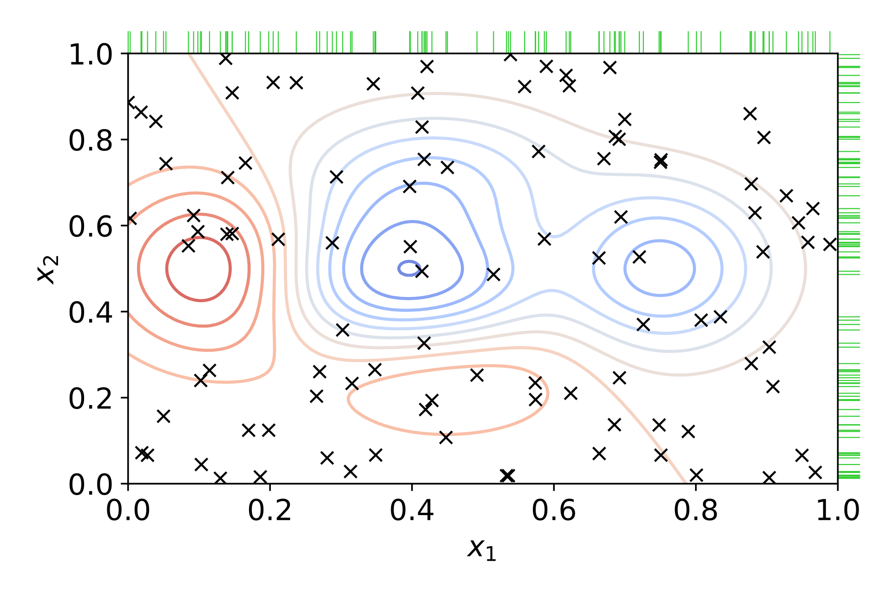

# Control of a wall-following robot with hyperparameters optimization

## Objectives
- To learn techniques to deal with an unbalanced datasets.
- To perform a systematic hyperparameter optimization.
- Apply various multilabel classification algorithms.
- To understand various uses of PCA.
- Use Scikit-Learn implementation of MLPs.

## Introduction
In this practice a robot controller is going to be trained to follow walls. The controller's perception is based on readings from 24 sensors spread around the robot, spaced at a constant angle. The robot can perform four actions: Move-Forward, Sharp-Right-Turn, Slight-Right-Turn and Slight-Left-Turn. The training of the controller will be performed with a dataset available at [this link](https://raw.githubusercontent.com/dfbarrero/dataCourse/master/assignments/wall/sensor_readings_24.csv).

## Unbalanced classes
There are several actions that can be taken to address an unbalanced dataset, the best approach will depend on the problem and the data itself. 

The usual precision and recall metrics used in classification, when there is unbalanced classes, lose reliability. Imagine, for example, a dataset with 99% of instances of a class A, and only 1% of class B. If we apply a dummy classifier that classifies everything as A, we will obtain an accuracy of 99%, which suggests excellent performance, but clearly this classifier will not be working correctly. For this reason accuracy and recall are rarely used with unbalanced datasets.

One of the most commonly used metrics with unbalanced data is F1, which is defined as the harmonic mean of the precision and recall:

$F1 = 2 \times \frac{\text{precision} \times \text{recall}}{\text{precision} + \text{recall}}$.

F1 is defined in a range from zero to one, with one corresponding to a perfect classification. The definition is made for binary classification problems, so it needs to be adapted to multi-label problems like the one we are dealing with. Scikit applies F1 to each class separately, obtaining several F1 values, which it then groups by means of an average. There are several methods to do this grouping, we will use the 'weighted' method, which weights the average by number of instances of each class, and is suitable for unbalanced datasets.

The most straightforward way to balance the classes is to undersample the majority class or oversample the minority class. A variation of the latter approach is to add noise to the oversampling in a controlled way, so as to bring more variety to the dataset, avoiding overlearning. In the context of Deep Learning this technique is known as "data augmentation".


More advanced techniques involve synthetically generating new instances of the minority class. For example, [SMOTE](https://machinelearningmastery.com/smote-oversampling-for-imbalanced-classification/) is a technique of some sophistication and quite popular that creates new instances of the minority class by sampling the straight line joining a minority class instance with some close neighbor. 

## Hyperparameter optimization

The performance of the models depends strongly on the hyperparameters, which is more clear when dealing with real-world problems. Since performance can be quantified, we can view this problem as a pure optimization problem, for which there are a multitude of techniques in the field of AI. 




One of the most widely used hyperparameter optimization techniques in Machine Learning is provided by the Scikit-Learn function *GridSearchCV()*, which is provided with the hyperparameters to be optimized and a range of values to be searched. The function creates a combination of hyperparameters and trains the model with each combination, returning the combination that performs best. It can apply cross-validation if required to.

```Python
from sklearn import svm, datasets
from sklearn.model_selection import GridSearchCV

iris = datasets.load_iris()

parameters = {'kernel':('linear', 'rbf'), 
              'C':[1, 10]}

svc = svm.SVC()
clf = GridSearchCV(svc, parameters)
clf.fit(iris.data, iris.target)
clf.best_params_
```

Please observe that *GridSearchCV()* returns an object that contains the result of the search, but behaves like a model.

Since the search space increases exponentially with the number of hyperparameters to be optimized, grid search becomes computationally intractable with some ease. A randomized search may be useful in these cases (*see RandomizedSearchCV()*), or other much more advanced methods such as bayesian optimization of Genetic Algorithms.

## Tasks

We will start the practice by loading the data:

- Download the [dataset](https://raw.githubusercontent.com/dfbarrero/dataCourse/master/assignments/wall/sensor_readings_24.csv). 
- Build a Pandas dataframe from the CSV. Note that the CSV has no headers, so you will have to add them somehow. Please, try not to write down a 25-elements list by hand.

We will continue with an EDA, but on the contrary than previous assignments, it will incorporate a multivariate analysis.

- Do an EDA including the usual aspects: presence of empty values, outliers, number of instances, number and type of attributes, main statistical properties of attributes, univariate and bivariate analysis, including correlations. 
- Normalize the data, for this purpose use the *MinMaxScaler* class of Scikit-Learn. In this case normalization is not very relevant because all attributes have the same units and share similar magnitudes, but some algorithms such as PCA may benefit.
- Extend the EDA with a multivariate analysis. To do this end apply PCA and visualize the components in 2D (or 3D, if desired) and visualize the amount of variance explained by each component. Evaluate the difficulty of classification based on this information along with the convenience of reducing the dimensionality of the data set with PCA. 

We continue with predictive modeling. The goal is to predict the robot's action based on its sonar sensor readings. 

- Set a baseline to compare with future results. Calculate the accuracy and F1 (look for the Scikit-Learn function *f1_score()*, with a weighted average) of a dummy classifier. What is the difference between them?
- Get a train, validation and test set.
- Apply appropriate classifiers with the default hyperparameters, obtaining F1. Since the dataset is unbalanced, stratify the split between the training and test sets to ensure that all classes are present in the same proportion. Note that the dataset is multi-class, so certain algorithms do not apply, and other algorithms will need adaptations. Use any collection of classifiers of your election with the exception of a MLP (artificial neural network).
- Optimize hyperparameters for each of the previous classifiers and compare the results. Use the *GridSearchCV()* function for this with weighted F1 as score.
  * Hint: This operation requires the training of a multitude of models and can potentially be computationally very demanding, especially if cross validation is added (not required for this practice, but recommended). One way to speed up the execution is to parallelize the search, for which the *n_jobs* parameter is used in the *GridSearchCV()* function. *n_jobs* contains the number of processors with which the search will be performed, by default it is 1, a value of -1 indicates the use of all processors.
  * Store the best model in a variable for later use.
 - Validate the F1 estimate obtained on the validation set. 
 <!--  * Hint: Use the function *cross_val_score()*.-->
 - Obtain the confusion matrix and a full report of the metrics of the best model.
 - Interpret, if possible, the best model.

Predict the robot's action with a MLP.
  - Train a MLP classifier as implemented in Scikit-Learn (class *MLPClassifier*), please check out the reference documentation) to predict the robot action. Manually set a collection of hyperparameters keeping 'sgd' as optimizer.
  - Use hyperparameter tuning to select a good set of the following hyperparameters:
    * Number of hidden layers.
    * Number of neurons per layer.
    * Activation function: ‘identity’, ‘logistic’, ‘tanh’ and ‘relu’.
    * Learning rate (argument *learning_rate_init* in Scikit-Learn's *MLPClassifier()*).
    * Momentum.
  - Compare the loss function during training with different optimizers: ‘lbfgs’, ‘sgd’ and ‘adam’. Use Scikit-Learn default hyperparameters.
  - Compare the loss function during training with different adaptative learning rate strategies: ‘constant’, ‘invscaling’ and ‘adaptive’. Use Scikit-Learn default hyperparameters.

Try to improve the above model by any means you deem appropriate. You can, for example, balance the training set by oversampling the minority class, use the PCA as input to the classifier, or apply ensemble-based classifiers.
